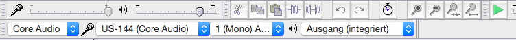

# Eine Spur aufnehmen

## Gesang

### Vorbereitung

#### Das Mikrofon aufstellen

Das Mikro mit ein wenig Geduld und Kraft stabil und liebevoll auf Mundhöhe fummeln.
Das Mikro möchte senkrecht stehen und ganz gerade von vorne angesungen werden...
Der beste Abstand zum Mikrofon ist etwa 30 cm. Sorge dafür, dass Du gerade und entspannt stehen und atmen kannst. Ist das nicht ganz der Fall, justiere bitte nach, es lohnt sich.

#### Anschließen

Das Mikrofonkabel kommt links vorne (`MIC IN L`) in das `TASCAM US-144`. Der Kopfhörer kommt vorne in die Mitte (bei `Phones`). Das USB-Kabel kommt hinten (quasi oben, wenn man draufschaut) bei `USB` rein und in den USB-Stecker am Mac.

#### Die Aufnahme am Mac vorbereiten

* Mit <kbd>⌘</kbd> + <kbd>Leertaste</kbd> die Spotlightsuche öffnen, `audacity` eintippen und <kbd>Enter</kbd> drücken.
* Falls ein Infodialog kommt, `OK` klicken.
* Der Screenshot zeigt Dir, wie die Einstellungen aussehen müssen: 

#### Die Aufnahme am Tascam US-144 einstellen

* Den Drehknopf mit dem Aufkleber auf `S` stellen, damit der Pegel stimmt.
* Wenn Du über Kopfhörer mithören möchtest: den Drehknopf `MON MIX` links oben ganz nach links drehen. Außerdem den Knopf `Phones` rechts oben auf etwa Dreiviertel stellen.
* **Ganz wichtig**: der Knopf `PHANTOM` muss `ON` sein und die rote Lampe an ist.

### Aufnehmen

Einfach auf `Record`  drücken und los!
Am Ende der Aufnahme auf `Stop` drücken ;-)

### Aufnahme speichern

* `Datei` -> `Projekt speichern unter...` und als Ziel bitte `Dokumente` (links)  und dann den Ordner `Aufnahmen/Rohmaterial/Gesang` wählen.
* Als Dateiname am besten `20170122 - Liedtitel` nehmen.

## Gitarre

### Vorbereitung

#### Das Mikrofon aufstellen

Das Mikro mit ein wenig Geduld und Kraft stabil und liebevoll auf Höhe der Gitarrenöffnung fummeln.
Das Mikro möchte möglichst ganz gerade von vorne - sozusagen parallel zur Gitarrenöffnung - angespielt werden...
Der beste Abstand zum Mikrofon ist etwa 30 cm. Sorge dafür, dass Du gerade und entspannt sitzen und spielen kannst. Ist das nicht ganz der Fall, justiere bitte nach, es lohnt sich.

#### Anschließen

Das Mikrofonkabel kommt links vorne (`MIC IN L`) in das `TASCAM US-144`. Der Kopfhörer kommt vorne in die Mitte (bei `Phones`). Das USB-Kabel kommt hinten (quasi oben, wenn man draufschaut) bei `USB` rein und in den USB-Stecker am Mac.

#### Die Aufnahme am Mac vorbereiten

* Mit <kbd>⌘</kbd> + <kbd>Leertaste</kbd> die Spotlightsuche öffnen, `audacity` eintippen und <kbd>Enter</kbd> drücken.
* Falls ein Infodialog kommt, `OK` klicken.
* Der Screenshot zeigt Dir, wie die Einstellungen aussehen müssen: 

#### Die Aufnahme am Tascam US-144 einstellen

* Den Drehknopf mit dem Aufkleber auf `S` stellen, damit der Pegel stimmt.
* Wenn Du über Kopfhörer mithören möchtest: den Drehknopf `MON MIX` links oben ganz nach links drehen. Außerdem den Knopf `Phones` rechts oben auf etwa Dreiviertel stellen.
* **Ganz wichtig**: der Knopf `PHANTOM` muss `ON` sein und die rote Lampe an ist.

### Aufnehmen

Einfach auf `Record`  drücken und los!
Am Ende der Aufnahme auf `Stop` drücken ;-)

### Aufnahme speichern

* `Datei` -> `Projekt speichern unter...` und als Ziel bitte `Dokumente` (links)  und dann den Ordner `Aufnahmen/Rohmaterial/Gesang` wählen.
* Als Dateiname am besten `20170122 - Liedtitel` nehmen.